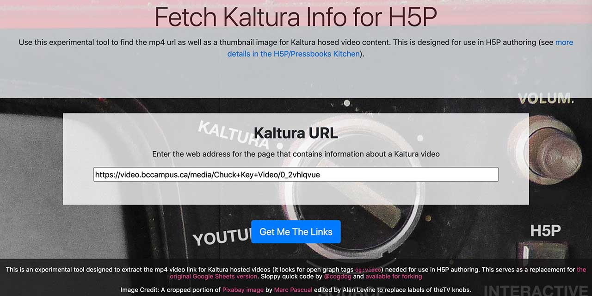
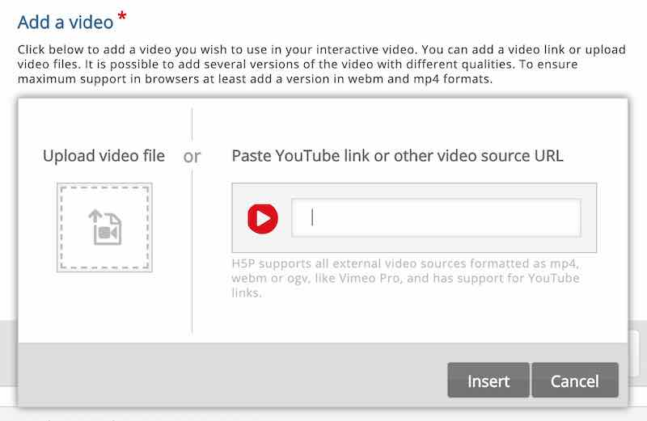

# Kaltura Video MP4 Fetcher

by Alan Levine http://cogdog.info/ or http://cogdogblog.com/

-----
*If this kind of stuff has any value to you, please consider supporting me so I can do more!*

 

----- 

## What is This?
Use this experimental tool to find the mp4 url as well as a thumbnail image for Kaltura hosed video content. This is designed for use in H5P authoring. See [more details in the H5P/Pressbooks Kitchen](https://kitchen.opened.ca/2020/08/04/switching-youtube-to-kaltura/). 

Try now! https://cogdog.github.io/mp4fetcher/

Use this in H5P, e.g.

# History

* Jan 31 2021: Now available as a web version, it does not much for error checking.
* Aug 4 2020: [First version created as Google Spreadsheet](https://kitchen.opened.ca/2020/08/04/switching-youtube-to-kaltura/)

